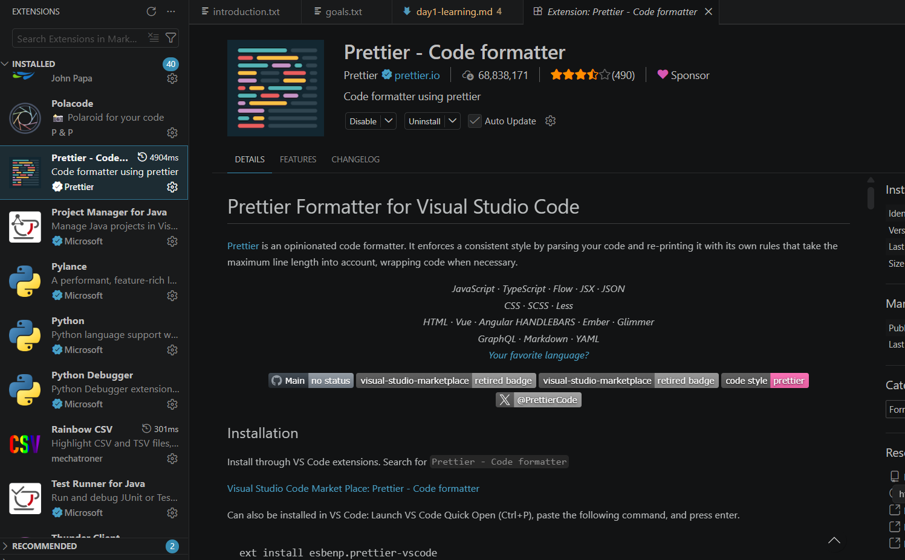
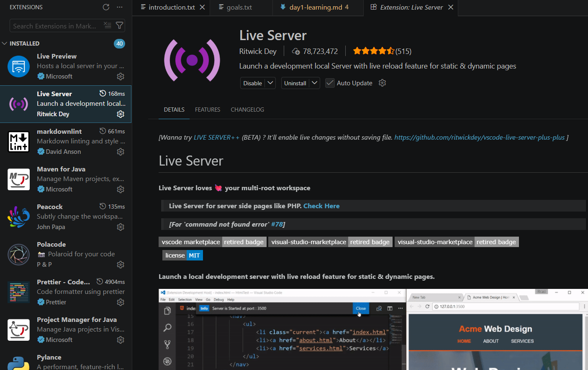
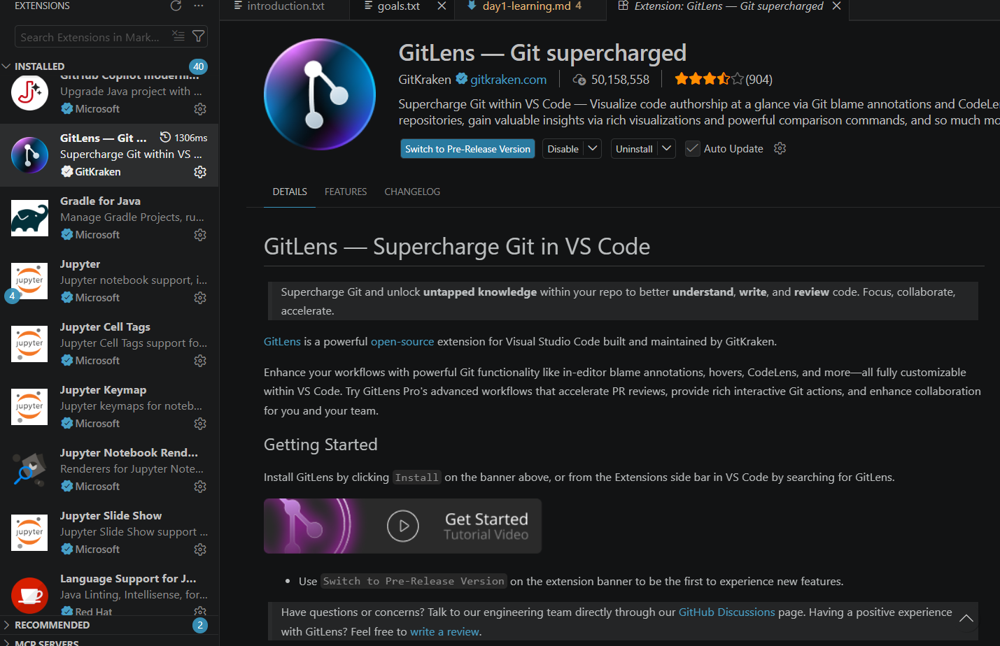
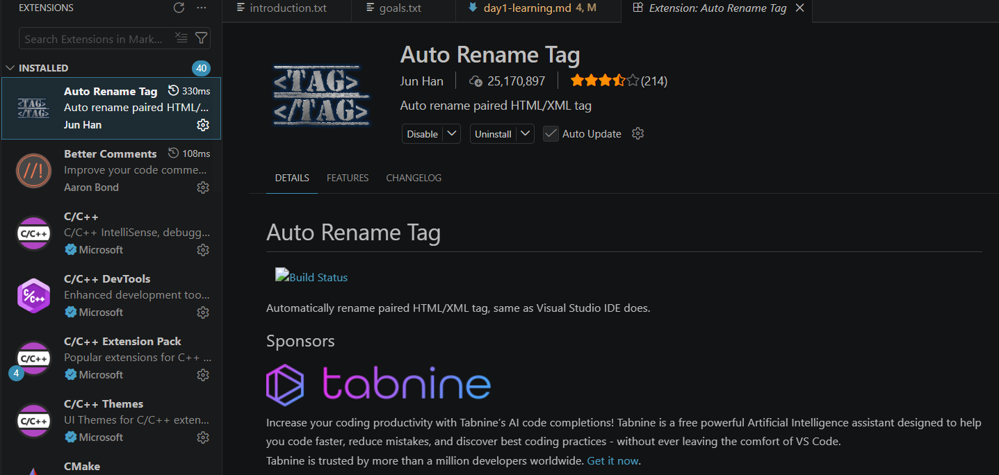

# Day 1 : Git, GitHub and VS Code Setup

## What is Git?

Git is a distributed version control system used to track changes in code and files during software development. It helps developers manage different versions of a project, collaborate efficiently, and restore previous versions if needed.

## What is GitHub?

GitHub is a cloud-based platform that allows developers to store, manage, and share Git repositories online. It provides collaboration features such as pull requests, issue tracking, and team project management.

## Difference Between Git and GitHub

Git is a tool used for version control on a local machine, while GitHub is an online platform that hosts Git repositories. Git helps track code changes, whereas GitHub helps developers collaborate and manage projects remotely.

## What I Learned Today

Today, I learned how to set up and use development tools such as Visual Studio Code, Git, and GitHub. I understood how to initialize a repository, connect a local project to GitHub, and manage project files using version control. I also learned the importance of proper project organization and collaboration tools in software development.

## Git Commands Learned Today

* `git init` → Initialize a new Git repository
* `git clone` → Copy a repository from GitHub
* `git status` → Check the status of files
* `git add` → Add files to the staging area
* `git commit` → Save changes with a commit message
* `git push` → Upload local commits to GitHub
* `git pull` → Fetch and update changes from GitHub
* `git log` → View commit history
* `git fetch` → Downloads the latest changes from the remote repository without merging them into the current branch.
* `git diff` → Shows the differences between files, commits, or branches in a repository.
* `git branch` → Used to create, list, or delete branches in Git.
* `git checkout / git switch` → Used to move between branches or restore files in a repository.
* `git merge` → Combines changes from one branch into another branch.
* `git remote` → Manages connections between the local repository and remote repositories like GitHub.
* `git stash` → Temporarily saves uncommitted changes so work can be paused without committing.

---

## Understanding the Difference Between `git fetch` and `git pull`

`git fetch` only downloads the latest changes from the remote repository and keeps them separate from the current working branch. It allows developers to review changes before applying them.

`git pull` not only downloads the changes but also automatically merges them into the current branch. It is essentially a combination of `git fetch` and `git merge`.

---

## Local vs Remote Repositories

A **local repository** is the version of the project stored on a developer’s own computer, where changes are made and tested. It allows offline work and personal version control.

A **remote repository** is hosted on platforms like GitHub or GitLab and is shared among team members. It helps in collaboration, backup, and synchronization of project changes.

---

## What is `origin` and Tracking Branches

`origin` is the default name given to the remote repository when a project is cloned from GitHub or another hosting platform. It acts as a shortcut reference to the remote repository URL.

A **tracking branch** is a local branch connected to a remote branch. It helps Git automatically know where to push changes and from where to pull updates, making collaboration easier.

## VS Code Setup

I set up VS code and downloaded the following extensions to enhace workflow -

* ### Prettier → Automatically formats code in a consistent style, improving readability and saving development time

##

* ### Live Server → Launches a local development server with live reload, allowing instant browser updates while editing webpages

* ### GitLens → Enhances Git capabilities by showing commit history, code authorship, and change tracking directly inside the editor

* ### Auto Rename Tag → Automatically renames paired HTML/XML tags together, reducing manual editing error and speeding up coding

